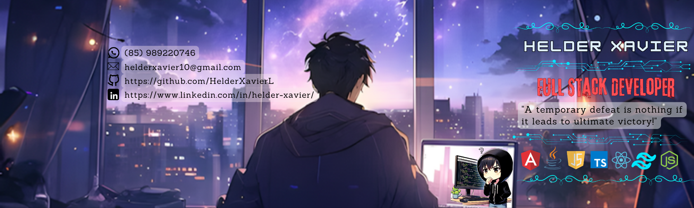

<!-- HEADER (opcional) -->
<!--  -->

<!-- RESUMO PROFISSIONAL -->

<h2>👨‍💻 Helder Xavier</h2>

🚀 Full Stack Developer | Frontend Specialist  
⚛️ React • Next.js • TypeScript • Node.js  
📈 Performance • UX • Scalable Systems  
📍 Brazil • Open to Remote Opportunities

I build modern, scalable and high-performance web applications, focusing on clean architecture, performance and user experience. 
Working across the full development cycle — from requirements gathering to deployment — delivering real business solutions. 
Founder of <strong>HexaDev</strong>, creating websites, systems and digital solutions for companies.

<!-- STATS -->

   
  
  
  

## 🧠 My Stack

## 🚀 About Me

- 💡 Frontend-focused Full Stack Developer with real project experience
- 🧠 Strong analytical mindset from industrial background
- ⚙️ Experience with APIs, automations and scalable systems
- 🤝 Freelancer working directly with clients and business needs
- 🚀 Founder of HexaDev — building digital solutions for real companies
- 💬 Always open to talk about tech, business and opportunities

## 📬 Contact Me

